# README
# 技术设计文档

本文档旨在明确Moment-Impressions（瞬间印象）应用的技术架构、核心组件设计、数据流转逻辑及关键实现细节。这是一款专注于图文分享的社交类应用，核心功能包括首页瀑布流展示动态、详情页查看图文及评论、发布图文动态、个人中心管理等，支持下拉刷新、点赞、评论等交互操作。

## 1. 架构概览

本项目采用 **MVVM (Model-View-ViewModel)** 架构模式，旨在实现 UI 逻辑与业务逻辑的分离，提高代码的可维护性和扩展性。

### 核心分层 

*   **View Layer (UI)**: 负责界面展示和用户交互。由 `Activity` 和 `Fragment` 组成，通过观察 `ViewModel` 中的 `LiveData` 来更新 UI。
*   **ViewModel Layer**: 负责 UI 数据的管理和业务逻辑的处理。它不持有 View 的引用，通过 `LiveData` 向 View 暴露数据。
*   **Model Layer (Data)**: 负责数据的获取、存储和处理。核心是 `Repository` 模式，统一管理来自网络 (Network) 或本地 (Local/Assets) 的数据。

---

## 2. 代码架构图


---

## 3. 核心类图 (Core Class Diagram)

### 3.1 基础架构类 


### 3.2 核心业务类

```mermaid
classDiagram
    class FeedRepository {
        -static FeedRepository instance
        -List~FeedItem~ allFeeds
        -List~CommentItem~ commentPool
        +static getInstance() FeedRepository
        +LiveData~List~FeedItem~~ getFeedList(int page)
        +LiveData~List~CommentItem~~ getComments(String feedId)
        +void toggleFeedLike(String feedId, boolean isLiked)
        +LiveData~Boolean~ addFeedItem(FeedItem item)
    }

    class FeedItem {
        -String id
        -String title
        -List~String~ images
        -User author
        -int likesCount
        -String time
    }

    class CommentItem {
        -String id
        -String content
        -User author
        -String time
    }

    class User {
        -String id
        -String nickname
        -String avatarUrl
    }

    class HomeViewModel {
        -FeedRepository repository
        +LiveData~List~FeedItem~~ getFeedList()
        +void refresh()
        +void loadMore()
    }

    class DetailViewModel {
        -FeedRepository repository
        +void loadComments(String feedId)
        +void addComment(String feedId, String content)
    }

    BaseViewModel <|-- HomeViewModel
    BaseViewModel <|-- DetailViewModel
    HomeViewModel ..> FeedRepository : uses
    DetailViewModel ..> FeedRepository : uses
    FeedRepository --> FeedItem : manages
    FeedRepository --> CommentItem : manages
    FeedItem --> User : has
    CommentItem --> User : has
```



---

## 4. 目录结构说明

```text
com.example.moment_impressions
├── core                    // 核心基础层
│   ├── base                // 基类定义 (BaseActivity, BaseFragment, BaseViewModel)
│   ├── net                 // 网络相关 (ApiService, RetrofitClient)
│   └── utils               // 工具类 (ImageLoader, ToastUtils)
├── data                    // 数据层
│   ├── model               // 数据实体 (FeedItem, CommentItem, User)
│   └── repository          // 数据仓库 (FeedRepository - 单例模式)
└── ui                      // 界面层
    ├── home                // 首页 (瀑布流列表)
    ├── detail              // 详情页 (图片轮播 + 评论)
    ├── publish             // 发布页 (发布图文)
    ├── profile             // 个人中心
    └── main                // 主入口
```

---

## 5. 关键技术点 

1.  **单例仓库模式 (Singleton Repository)**:
    *   `FeedRepository` 作为全局唯一的数据源，确保了首页列表、详情页、个人中心的数据一致性（如点赞状态同步）。
    *   采用内存缓存 (`localCache`, `allFeeds`) + 模拟网络延迟的设计。

2.  **图片加载策略**:
    *   封装 `ImageLoader` 工具类，底层使用 **Glide**。
    *   支持 `android.resource://` 协议加载本地资源，确保无网络环境下图片也能正常显示。
    *   详情页使用 `centerCrop` 策略统一图片显示效果。

3.  **UI 组件**:
    *   **RecyclerView + StaggeredGridLayoutManager**: 实现首页瀑布流效果。
    *   **ViewPager2**: 实现详情页多图轮播。
    *   **SwipeRefreshLayout**: 实现下拉刷新。

4.  **数据模拟**:
    *   使用 `feeds.json` 和 `comments.json` 作为初始数据源。
    *   通过 `Random` 和逻辑判断（如时间解析）生成动态交互数据（如模拟评论时间）。